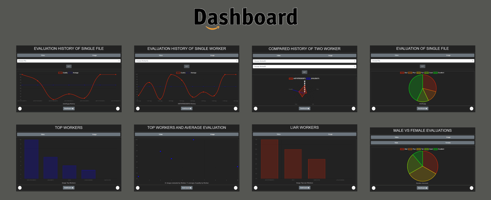

# DashboardForMTurkResults
#### Funzionamento:
Questa Dashboard interagisce con il database che viene creato nel progetto [ImageAndVideoQualityAmazonMTurk](https://github.com/edoardore/ImageAndVideoQualityAmazonMTurk).
Si mostrano 7 grafici:
1) Storia delle valutazioni per un singolo file (Immagine o Video). (Line graph)
2) Storia delle valutazioni effettuate da un singolo Worker (su Video o Immagini). (Line graph)
3) Confronto delle valutazioni effettuate da due Worker. (Radar graph)
4) Risultati ottenuti per un singolo file. (Pie graph)
5) Worker ordinati in base alle HIT effettuate e sottomesse. (Bar graph)
6) Worker che hanno sottomesso piu HIT e media dei valori della qualità inserita da essi. (Scatter graph)
7) Ordina i worker 'bugiardi' sulla base delle età e sesso differenti che hanno inserito nelle HIT. (Bar graph)
8) Mostra risultati di soli Workers maschi o femmine. (Pie graph)
9) Visione di 3 grafici a scelta fra quelli precedenti in contemporanea. (Modular)
### Video Example:

## License
[Edoardo Re](https://github.com/edoardore), 2019

[Chart.js](https://www.chartjs.org)

